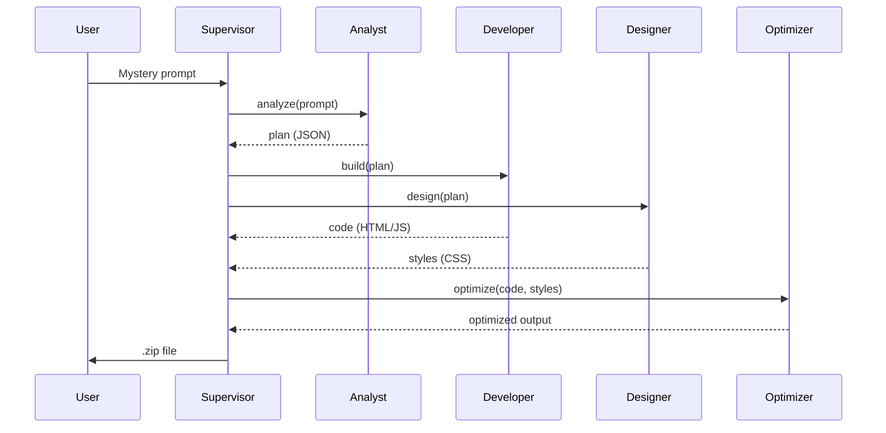

# Full‑Stack Polymath

**Build anything from a mystery prompt with a multi‑agent AI system.**  
[Seedstr Blind Hackathon](https://seedstr.io/hackathon).

---

## 📖 Overview

Full‑Stack Polymath is an autonomous multi‑agent system designed to ace the Seedstr Blind Hackathon. Given any mystery prompt, it orchestrates specialized AI agents to produce a complete, production‑ready front‑end project (`index.html`, `style.css`, `script.js`) packaged as a `.zip` file. The system scores high on **Functionality**, **Design**, and **Speed**—the three judging criteria.


---

## 🏗️ Architecture

The system uses a **centralized supervisor** with a **message bus** to coordinate five specialized agents. All communication is asynchronous, enabling parallel work where possible.

```mermaid
graph TB
    subgraph "Message Bus"
        MB[("Async Queues")]
    end

    User -->|Mystery Prompt| Supervisor
    Supervisor -->|"analyze"| MB
    MB -->|"analyze"| Analyst
    Analyst -->|"analysis_complete"| MB
    MB -->|"analysis_complete"| Supervisor

    Supervisor -->|"build" & "design"| MB
    MB -->|"build"| Developer
    MB -->|"design"| Designer

    Developer -->|"build_complete"| MB
    Designer -->|"design_complete"| MB
    MB -->|"build_complete" & "design_complete"| Supervisor

    Supervisor -->|"optimize"| MB
    MB -->|"optimize"| Optimizer
    Optimizer -->|"optimize_complete"| MB
    MB -->|"optimize_complete"| Supervisor

    Supervisor -->|"package"| ZIP[".zip file"]
    ZIP -->|download| User
```

### Agent Roles

| Agent       | Responsibility                                                                 |
|-------------|--------------------------------------------------------------------------------|
| **Supervisor** | Orchestrates the workflow, maintains task state, and packages final output. |
| **Analyst**     | Deconstructs the mystery prompt into a structured technical plan.            |
| **Developer**   | Writes clean, functional HTML and JavaScript.                                |
| **Designer**    | Generates responsive, accessible, and visually appealing CSS.                |
| **Optimizer**   | Measures performance, minifies code, and improves speed.                     |

---

## ⚙️ How It Works

1. **Submit Prompt** – User sends a mystery prompt via API or web UI.
2. **Analyze** – The Analyst creates a JSON plan (project type, features, tech stack).
3. **Parallel Build** – Developer and Designer work simultaneously.
4. **Optimize** – The Optimizer refines the combined output (minification, performance).
5. **Package** – Supervisor assembles `index.html`, `style.css`, `script.js` into a `.zip`.
6. **Download** – User receives the final project.



---

## 🚀 Getting Started

### Prerequisites

- Python 3.11+
- OpenAI API key (set as `OPENAI_API_KEY` environment variable)

### Installation

1. **Clone the repository**
   ```bash
   git clone https://github.com/yourusername/fullstack-polymath.git
   cd fullstack-polymath
   ```

2. **Install dependencies**
   ```bash
   pip install -r requirements.txt
   ```

3. **Set your OpenAI API key**
   ```bash
   export OPENAI_API_KEY="sk-..."
   ```

4. **Run the backend server**
   ```bash
   uvicorn main:app --reload
   ```

5. **Open the frontend**  
   Serve the `index.html` from the `frontend` folder (or use a live server extension).

---

## 📡 API Reference

The backend exposes a REST API. Full interactive docs at `http://localhost:8000/docs`.

### `POST /start`

Start a new build.

**Request body:**
```json
{
  "prompt": "Build a weather dashboard using OpenWeatherMap",
  "enable_human": false
}
```

**Response:**
```json
{
  "task_id": "550e8400-e29b-41d4-a716-446655440000",
  "message": "Build started"
}
```

### `GET /status/{task_id}`

Get build status and logs.

**Response:**
```json
{
  "task_id": "...",
  "status": "in_progress",
  "stage": "building",
  "logs": ["Analyst done", "Developer started"],
  "zip_available": false
}
```

### `GET /download/{task_id}`

Download the final `.zip` file when `status` is `"ready"`.

---

## 🖥️ Frontend

The single‑page React frontend (`frontend/index.html`) provides:

- A textarea to enter the mystery prompt
- Real‑time agent status updates (via polling or WebSocket)
- Live preview of the generated project
- Download button for the `.zip`


---

## 🔧 Configuration

| Environment Variable   | Description                          | Default       |
|------------------------|--------------------------------------|---------------|
| `OPENAI_API_KEY`       | Your OpenAI API key (required)       | –             |
| `OPENAI_MODEL_FAST`    | Model for non‑critical agents        | `gpt-3.5-turbo` |
| `OPENAI_MODEL_SLOW`    | Model for planning/code generation   | `gpt-4-turbo-preview` |
| `MAX_RETRIES`          | LLM retry attempts                   | `3`           |
| `TASK_TIMEOUT`         | Maximum time per build (seconds)     | `300`         |

---

## 🧪 Testing

Run unit tests:

```bash
pytest tests/
```

Integration tests (requires running backend):

```bash
python tests/integration.py
```

---

## 🛠️ Technologies Used

- **Backend**: FastAPI, OpenAI API, aiofiles, uvicorn
- **Frontend**: React (via CDN), vanilla CSS, Font Awesome
- **Database** (optional): SQLite (for task persistence)
- **Async**: asyncio, message bus pattern

---

## 🤝 Contributing

Contributions are welcome! Please open an issue or submit a pull request.

1. Fork the repository
2. Create a feature branch (`git checkout -b feature/amazing`)
3. Commit your changes (`git commit -m 'Add amazing feature'`)
4. Push to the branch (`git push origin feature/amazing`)
5. Open a Pull Request

---

## 📄 License

MIT License – see [LICENSE](LICENSE) file.
